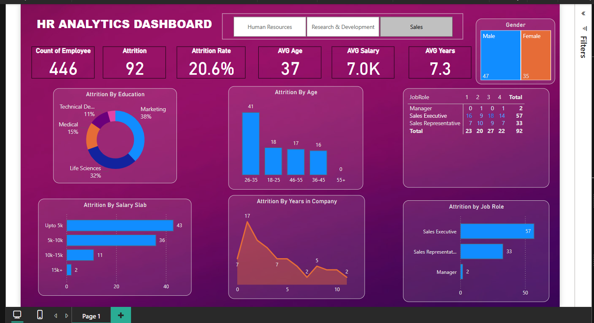

# 📊 HR Analysis BI Dashboard

A Power BI dashboard built for in-depth analysis of employee data to uncover insights into attrition, compensation, job satisfaction, and organizational structure.

---

## 🔍 Project Summary

This HR analytics dashboard allows stakeholders to explore employee behavior and HR performance through visual KPIs and interactive reports. The dataset includes records of **1,480 employees** across various departments and roles.

---



---

## 🧾 Dataset Overview

The data consists of **38 features** covering demographics, job info, performance metrics, and attrition labels.

| Category                 | Features Include                                                                 |
|--------------------------|----------------------------------------------------------------------------------|
| Employee Demographics    | `Age`, `Gender`, `AgeGroup`, `MaritalStatus`                                    |
| Employment Details       | `Department`, `JobRole`, `JobLevel`, `MonthlyIncome`, `TotalWorkingYears`       |
| Job Satisfaction & Engagement | `JobSatisfaction`, `WorkLifeBalance`, `EnvironmentSatisfaction`, `OverTime` |
| Attrition Info           | `Attrition`, `YearsAtCompany`, `DistanceFromHome`, `YearsSinceLastPromotion`   |

### Key Stats:
- 👥 **Total Employees:** 1,480  
- 💼 **Departments:** Research & Development, Sales, Human Resources  
- 👔 **Job Roles:** 9 distinct titles (e.g., Manager, Scientist, Technician)  
- 👩‍🔬 **Top Education Fields:** Life Sciences, Medical, Marketing  
- 💰 **Avg Monthly Income:** ₹6,505  
- ⚖️ **Attrition Rate:** 16.1%  
- 👨‍🦱 **Gender Split:** 60% Male, 40% Female  

---

## 📌 KPI Breakdown

| KPI                          | Description                                                                 |
|------------------------------|-----------------------------------------------------------------------------|
| **Attrition Rate**           | % of employees who left the company (`Attrition = Yes`)                     |
| **Avg. Monthly Income**      | Average employee income across all roles and levels                         |
| **Total Employees**          | Total number of active or recorded employees                                |
| **Avg. Years at Company**    | Measures employee tenure and retention trend                                |
| **Work-Life Balance Index**  | Aggregated average of self-reported work-life satisfaction (scale 1–4)      |
| **Job Satisfaction**         | Average rating for job satisfaction across roles                            |
| **Overtime Distribution**    | % of employees who work overtime vs those who don’t                         |
| **Department-wise Headcount**| Employee count grouped by department                                        |

---

## 📈 Dashboard Insights

### 🔥 Attrition Insights
- Most attrition is observed among **younger employees (18–25 age group)**.
- Employees working **overtime** show significantly higher attrition.
- **Sales Representatives** and **Laboratory Technicians** show the highest turnover.

### 🏢 Department Insights
- **Research & Development** has the largest workforce.
- **Human Resources** is the smallest department by headcount.

### 💸 Compensation Trends
- Higher **job levels** correlate with higher monthly income.
- Average salary for **Managers** is significantly above the company average.
- Salary slabs are evenly distributed among experienced roles.

### 🧘 Work-Life Balance & Satisfaction
- Most employees rate **work-life balance as good (3/4)**.
- Low job satisfaction often aligns with high attrition areas.

---

## 📁 Files in Repository

HR_ANALYSIS_BI/
├── HR_ANALYSIS_BI.pbix # Power BI dashboard
├── HR_Analytics.csv # HR dataset
├── snippet.png # Dashboard
└── README.md # Project documentation (this file)


🛠 Tools & Technologies
 -Power BI Desktop – For building the interactive dashboard
 -CSV Dataset – Source HR data used in the report

## 🚀 How to Use

1. Clone the repository:
   ```bash
   git clone https://github.com/yourusername/HR_ANALYSIS_BI.git
